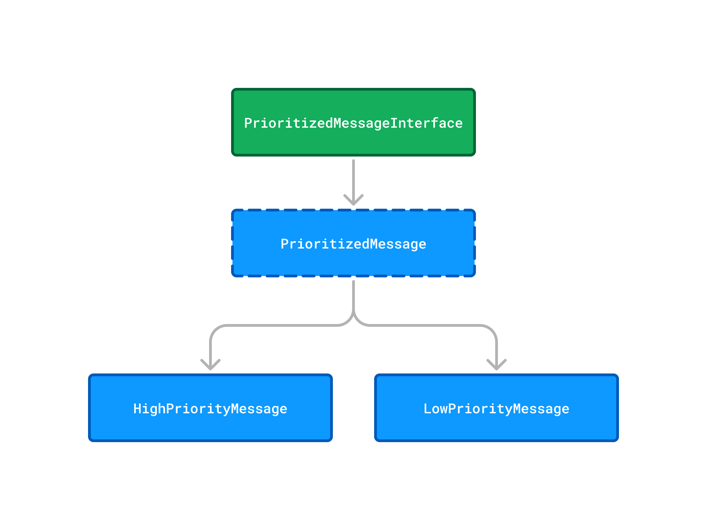

# Technical documentation

This document highlights the most important technical decisions for this application.

## Prioritized messages

There are currently 2 types of messages:

* `HighPriorityMessage`
* `LowPriorityMessage`

Both of these classes follow the contract defined in the `PrioritizedMessageInterface`.

The abstract `PrioritizedMessage` class acts as a base implementation of the `PrioritizedMessageInterface` to provide common functionality
for prioritized messages, including the handling of the recipient, message body, and subject data.



## Message generation

Message can be generated using the `PrioritizedMessageFactory` or `RandomPrioritizedMessageFactory`.

### PrioritizedMessageFactory

The `PrioritizedMessageFactory` can be used to generate a prioritized message for the given priority.
Additionally, data can be passed to pre-fill the generated object. To create a new message instance the `create()` method can be used like so:

**Create a high priority message**

```php
$prioritizedMessageFactory = new PrioritizedMessageFactory();
$prioritizedMessage = $prioritizedMessageFactory->create(PrioritizedMessageInterface::PRIORITY_HIGH);
```

**Create a low priority message with prefilled data**

```php
$prioritizedMessageFactory = new PrioritizedMessageFactory();
$prioritizedMessage = $prioritizedMessageFactory->create(
    PrioritizedMessageInterface::PRIORITY_LOW,
    'test@example.com',
    'This is my message body',
    'This is the subject',
);
```

### RandomPrioritizedMessageFactory

The `RandomPrioritizedMessageFactory` can be used to generate a prioritized message for the given priority filled with random data.
It utilized the `PrioritizedMessageFactory` to generate an empty instance of the `PrioritizedMessageInterface`.

The [Faker PHP Library](https://fakerphp.org) is used to generate random data, which is then assigned to the generated `PrioritizedMessageInterface`.

**Create a high priority message**

```php
$prioritizedMessageFactory = new RandomPrioritizedMessageFactory();
$prioritizedMessage = $prioritizedMessageFactory->create(PrioritizedMessageInterface::PRIORITY_HIGH);
```

**Create a low priority message**

```php
$prioritizedMessageFactory = new RandomPrioritizedMessageFactory();
$prioritizedMessage = $prioritizedMessageFactory->create(PrioritizedMessageInterface::PRIORITY_LOW);
```