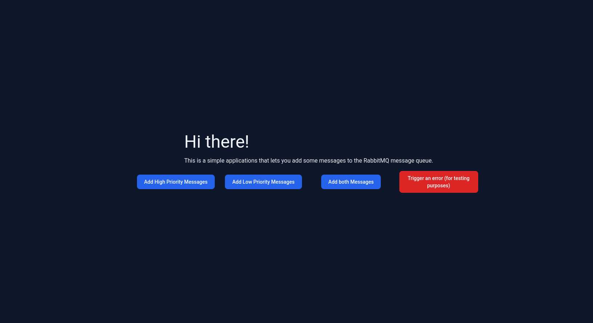

# User guide

## Dispatching messages

This simple application lets you dispatch low priority, and high priority messages to RabbitMQ.
There are currently 2 ways to trigger this process.

### Via the user interface (web application)

The easiest way to add messages to the queue is by using the user interface.
After following the step to run this application locally (Outlined in README.md), you can visit the application at https://symfony-queue-processor.ddev.site.

Once here you should be presented with the following page



The first 3 buttons on this page can be used to dispatch messages to the queue, and the 4th is used to simulate an error response.

The following logic is assigned to each button:

#### Add high priority messages
Generates 100 high priority messages with random data and sends them to the queue.

#### Add low priority messages
generates 100 low priority messages with random data and sends them to the queue.

#### Add both messages
generates 100 high priority, and 100 low priority messages with random data and sends them to the queue.

#### Trigger an error
Send a request with an invalid priority which fails the validation.

### Via the CLI (command line interface)

Messages can also be added via a symfony console command.
After following the step to run this application locally (Outlined in README.md),
you will be able to access the `symfony bin/console` command within the docker container via the alias `ddev symfony`.

To add a message the `ddev symfony app:add-prioritized-message` command can be used to add messages to the queue.

#### Usage

```text
Usage:
  app:add-prioritized-message [options] [--] <priority> [<count>]

Arguments:
  priority                   Priority of the message (either high or low).
  count                      The amount of messages to add to the queue (optional). [default: 1]

Options:
  -m, --message[=MESSAGE]    The message to send (optional). Discard to add a random message.
  -s, --subject[=SUBJECT]    The subject to use for the message (optional). Discard to add a random subject.
  -r, --recipient[=RECIPIENT]  The email address the message confirmation is sent to (optional). Discard to add a random recipient.
```

#### Example

**Add a single, high priority message, with a specific recipient, and random message and subject, to the queue**

```shell
ddev symfony app:add-prioritized-message -r "test@example.com" high
```

**Add 10, random low priority message to the queue:**

```shell
ddev symfony app:add-prioritized-message low 10
```

**Add 5, low priority messages, with the given data, to the queue:**

```shell
ddev symfony app:add-prioritized-message -m "This is the message" -s "This is the subject" -r "test@example.com" low 5
```

## Consuming messages

Triggering queue consumption is currently only available via a symfony console command.

### Starting consumption

To start the message consumer run the following command:

```shell
ddev symfony messenger:consume async_priority_high async_priority_low
```

Or if you would like to have a more verbose output add the `-vv` parameter

```shell
ddev symfony messenger:consume async_priority_high async_priority_low -vv
```

### Stopping consumption

To stop the message consumer either press `CONTROL + C`, or run the following command:

```shell
ddev symfony messenger:stop-worker
```

## Viewing the results

### RabbitMQ

After following the step to run this application locally (Outlined in README.md) you can access the 
RabbitMQ web interface on https://symfony-queue-processor.ddev.site:15673.
When prompted to log in you can use the default username and password (rabbitmq). After logging in you should see the following screen

For more details on the RabbitMQ management UI, please refer to the [official documentation](https://www.rabbitmq.com/docs/management).

### Mailpit

By default, this application is set up to catch all outgoing emails with Mailpit.
After following the step to run this application locally (Outlined in README.md) you can access the Mailpit UI on https://symfony-queue-processor.ddev.site:8026.

For each message that is processed an email will be sent. The priority of the message is added to both the subject line and the preheader.
